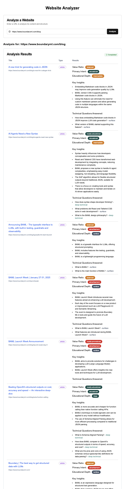

# Blog-analyzer

Video demo: [https://youtu.be/rQm-kX4ePt8](https://youtu.be/rQm-kX4ePt8)

This project demonstrates how to build a web application that scrapes a website, analyzes its content using Large Language Models (LLMs) via [BAMl](https://github.com/BoundaryML/baml), and streams the analysis results back to a user interface in real-time.

It takes a starting URL, crawls linked pages within the same domain, and for each page, it determines the content type (blog post, article, other) and analyzes its depth, commercial intent, key insights, and technical questions answered.




## Features

*   **Web Scraping:** Crawls a website starting from a given URL, following links within the same domain (up to a configurable limit).
*   **Full-Page Screenshots:** Captures a full-height screenshot of each scraped page using Selenium.
*   **LLM-Powered Content Analysis:** Uses BAMl functions to interact with LLMs (like GPT-4o and GPT-4o-mini) to:
    *   Determine the page title and content type (Blog Post, Article, Other).
    *   Analyze content depth (Surface, Intermediate, Deep).
    *   Assess the balance between educational and promotional content.
    *   Identify primary intent (Educational, Advertisement).
    *   Extract key insights and technical questions answered.
*   **Real-time Streaming UI:** A Next.js frontend displays the analysis results as they become available, providing immediate feedback to the user.
*   **Efficient Caching:** Scraped HTML content, screenshots, and analysis results are cached locally on disk to avoid redundant processing and API calls.
*   **Async Backend:** Built with FastAPI and asyncio for efficient handling of concurrent scraping and analysis tasks.

## Tech Stack

*   **Backend:** Python, FastAPI, asyncio, Pydantic
*   **Scraping:** Selenium, BeautifulSoup4, Requests
*   **LLM Interaction:** BAML (BoundaryML)
*   **Frontend:** Next.js, React, TypeScript, Tailwind CSS (based on typical Next.js setups)
*   **Package Management:** `uvicorn` (for FastAPI), `pnpm` (for Next.js)

## Getting Started: A Step-by-Step Tutorial

Follow these steps to get the Website Content Analyzer running on your local machine.

### Prerequisites

1.  **Python:** Ensure you have Python 3.10 or later installed.
2.  **Node.js & pnpm:** Install Node.js (which includes npm) and pnpm. You can install pnpm via `npm install -g pnpm`.
3.  **Google Chrome & ChromeDriver:** Selenium requires a web browser and its corresponding driver. Install Google Chrome and download the matching ChromeDriver executable, ensuring it's accessible in your system's PATH.
4.  **OpenAI API Key:** The analysis relies on OpenAI models. Get an API key from [OpenAI](https://platform.openai.com/).

### Installation & Setup

    ```

2.  **Backend Setup:**
    *   **Create & Activate Virtual Environment:**
        ```bash
        python -m venv .venv
        # On macOS/Linux
        source .venv/bin/activate
        # On Windows
        # .venv\Scripts\activate
        ```
    *   **Install Python Dependencies:** (Assuming you have a `requirements.txt`)
        ```bash
        pip install -r requirements.txt
        ```
    *   **Configure Environment Variables:** Create a file named `.env` in the project root directory and add your OpenAI API key:
        ```dotenv
        # .env
        OPENAI_API_KEY=your_openai_api_key_here
        # Add BAML_API_KEY if you are using BAML cloud features
        # BAML_API_KEY=your_baml_api_key_here
        ```

3.  **Frontend Setup:**
    *   **Install Node Dependencies:**
        ```bash
        cd frontend
        pnpm install
        ```

### Running the Application

1.  **Start the Backend Server:**
    *   Make sure your virtual environment is activated (`source .venv/bin/activate`).
    *   Run the FastAPI application using uvicorn:
        ```bash
        fastapi run app --reload
        ```
    *   The backend API will be available at `http://localhost:8000`.

2.  **Start the Frontend Development Server:**
    *   Open a *new* terminal window/tab.
    *   Navigate to the frontend directory:
        ```bash
        cd frontend
        ```
    *   Run the Next.js development server:
        ```bash
        pnpm dev
        ```
    *   The frontend UI will be available at `http://localhost:3000`.

## Usage

1.  Open your web browser and navigate to `http://localhost:3000`.
2.  You should see the "Website Analyzer" interface.
3.  Enter the URL of a website you want to analyze (e.g., `https://www.boundaryml.com/blog`).
4.  Click the "Analyze" button.
5.  The backend will start scraping and analyzing in the background.
6.  Observe the "Analysis Results" section on the page. Pages found will appear first as "Pending" or "Loading", and the detailed analysis will populate as soon as it's completed by the LLM, streaming the updates to the UI.

## Project Structure

```
.
├── .venv/                  # Python virtual environment
├── baml_src/               # BAMl source files
│   └── blog_analyzer.baml  # BAMl function definitions for analysis
├── data/                   # Cached data (created automatically)
│   └── <domain_name>/      # Cache per domain
│       └── <path_slug>/    # Cache per page
│           ├── analysis.json       # Cached LLM analysis results
│           ├── content.txt         # Cached raw HTML content
│           └── full_screenshot.png # Cached page screenshot
├── frontend/               # Next.js frontend application
│   ├── components/         # React components
│   ├── app/                # Next.js App Router pages/layouts
│   ├── lib/                # Frontend utilities/types
│   ├── public/             # Static assets
│   ├── styles/             # CSS/styling
│   ├── next.config.js      # Next.js configuration
│   ├── package.json        # Node dependencies
│   ├── pnpm-lock.yaml      # pnpm lock file
│   └── tsconfig.json       # TypeScript configuration
├── .env                    # Environment variables (Needs creation)
├── app.py                  # FastAPI application entry point, API endpoints
├── files.py                # Utility functions for managing file paths
├── hello.py                # Core analysis orchestration logic
├── scraper.py              # Selenium web scraper logic
├── requirements.txt        # Python dependencies (Needs creation or update)
└── README.md               # This file
```

## How It Works

1.  **Initiation (Frontend -> Backend):** The user enters a URL in the Next.js UI and clicks "Analyze". The frontend sends a POST request with the URL to the `/analyze` endpoint on the FastAPI backend.
2.  **Background Task:** The `/analyze` endpoint checks if analysis for this URL is already running. If not, it initializes a `SiteAnalysis` object in memory (a simple dictionary `analysis_results` acts as an in-memory store) and starts the `analyze_website` function as a FastAPI background task. This allows the API to return an immediate "Analysis started" message to the UI without blocking.
3.  **Scraping (`scraper.py`):** The `analyze_website` function calls `scrape_website`. This function uses a queue and a set of visited URLs to perform a breadth-first crawl starting from the base URL.
    *   For each URL, it checks if the content/screenshot is already cached in the `./data/` directory. If so, it yields the cached data.
    *   If not cached, it uses Selenium WebDriver (in headless mode) to:
        *   Navigate to the URL.
        *   Extract the full page's HTML source (`driver.page_source`).
        *   Capture a full-height screenshot of the page.
        *   Save the HTML and screenshot to the `./data/` directory.
        *   Yield the URL, HTML content, and screenshot image.
    *   It parses the HTML for `<a>` tags, extracts valid links within the same domain, and adds new, unvisited links to the queue.
4.  **Analysis Orchestration (`hello.py`):** As `scrape_website` yields page data, `analyze_website`:
    *   Adds the `page_url` to the `pages` list within the shared `SiteAnalysis` object.
    *   Creates an asyncio task to run `analyze_page` for the yielded content and image. A semaphore limits concurrent LLM calls.
5.  **LLM Analysis (`hello.py` & `baml_src/blog_analyzer.baml`):** The `analyze_page` function:
    *   Checks if the analysis result (`analysis.json`) is cached. If yes, returns it.
    *   Calls the `b.IsBlogPost` BAMl function with the page content to get the title and type.
    *   If the type is not "other", it calls the `b.AnalyzeContentDepth` BAMl function to get the detailed content analysis.
    *   Packages the results into an `ExportedAnalysis` object.
    *   Saves the analysis to `analysis.json` in the cache directory.
    *   Returns the `ExportedAnalysis` object.
6.  **Updating Results:** When an `analyze_page` task completes, its result (`ExportedAnalysis`) is added to the `results` list within the shared `SiteAnalysis` object in memory.
7.  **Streaming via Polling (Backend -> Frontend):** The Next.js frontend periodically (e.g., every second) sends a GET request to the `/results` endpoint, passing the original URL.
8.  **Serving Results:** The `/results` endpoint retrieves the current state of the `SiteAnalysis` object for the requested URL from the in-memory `analysis_results` dictionary. It formats the data (mapping page URLs to their corresponding analysis results, or `null` if not yet available) and sends it back to the frontend.
9.  **UI Update:** The frontend receives the latest status and results data and updates the React components, showing loading states or the completed analysis for each page. This polling mechanism creates the streaming effect.

## Configuration

*   **`.env` file:** Create this file in the project root.
*   **`OPENAI_API_KEY`:** (Required) Your API key for OpenAI models.
*   **Scraper:** You can adjust `max_links` in `scraper.py` to limit the number of pages crawled.
*   **Concurrency:** The `asyncio.Semaphore(5)` in `hello.py` limits concurrent calls to the LLM analysis functions. Adjust the number (5) based on your rate limits and system resources.

---

🐑
